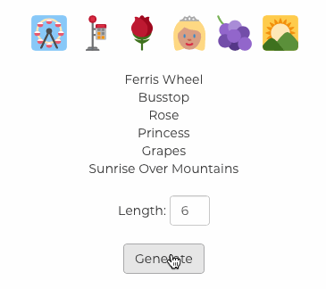

# Emoji Password Maker 🙃 👌 🧠 💅

Exercise inspired by [Kamogo (Neal Agarwal)](https://www.kamogo.com)

You'll be creating a password generator...that only produces passwords made of emojis!

## Setup

* Clone this repo
* Run `npm install`
* Try `npm start` to run the Dev Server or `npm run dev` to build for Development

## Instructions

* Create an emoji password generator using React using state, class components and functional components!
* First sketch out how the app should look and what components you'll need to make
* Learn how to use the emoji icons here: [http://ellekasai.github.io/twemoji-awesome/](http://ellekasai.github.io/twemoji-awesome/)
* Give users the ability to set the length (1-99)
* Show a human readable list of the emojis produced
* Emojis shouldn't repeat
* How it should work:

## Scripts

* `npm start` for Webpack Dev Server
* `npm run dev` for development
* `npm run build` for production